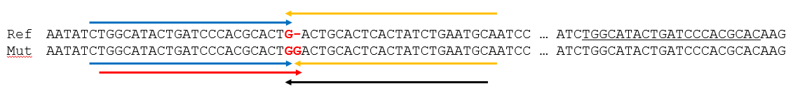

# get_seq_near_target_index

[Main_SY.py multi_processing_ClinVar_by_all_cds() 관련](./Main_SY.py)

 
multi_processing_ClinVar_by_all_cds()     
input : 
    ALL_CDS_INFO = "all_ccds_filtered_201130_CCDS_" + TYPE + "_current.txt"  # 20201217         
    MUT_INFO = [ClinVar_data : ./input/200907_Dominant filter.txt](./input/200907_Dominant filter.txt)
    
    1. filter out ClinVar_data by POS if POS is not in CDS from ALL_CDS_INFO
       
    1. get rows in ClinVar_data(= MUT_INFO) if POS(= clvg_site) is in CDS(ALL_CDS_INFO = idx_list)          
        1-1. filter out rows from ClinVar_data if POS is in the edges' POS of exon 
        1-2. get seq pairs with WIN_SIZE near target seq(= POS column in ClinVar_data, len(REF column)) in CDS not in whole genome
        1-3. make ref_seq and mut_seq
            1-3-1. 
        1-4. 

1. filter out ClinVar_data by POS if POS is not in CDS from ALL_CDS_INFO        
* how to get CDS_list by POS
    1) find (????? 
                (gene, gene_id or ccds_id from 201130_CCDS_human_current.txt ) 
                (GeneSym or NMID from all_ccds_filtered_201130_CCDS_human_current.txt)
            ????? gene = gene_id = GeneSym) of CDS
            if POS is in any CDS (ExonS_list, ExonE_list)
            
    2) get all CDS by (????? gene, gene_id, ccds_id, GeneSym or NMID ?????) from 1). including CDS that doesn't have POS  

* how to find guide + PAM
    plan_A : search PAM in each CDS regions ( get guide seq from whole genome if guide is out of CDS )
             gene info, POS existance from CCDS 
             seq from whole-genome sequence
    plan_B : search PAM in only ALT part from WIN_SIZE + ALT + WIN_SIZE (both of WIN_SIZEs are from whole genome)
    
    plan_A for REF, plan_B for ALT
    results of guide + PAM = plan_B - plan_A 

+++++++++++++++++++++++++++++++++++++++++++++++++++++++++++++++++++++++++++++++++++++++++++++++++++++++++++++++++
D:\000_WORK\SeoSangYeon\20200907_ClinVar\20201224_ClinVar_dominant mutations_selective knockout sgRNA design.pptx
+++++++++++++++++++++++++++++++++++++++++++++++++++++++++++++++++++++++++++++++++++++++++++++++++++++++++++++++++
    sgRNA design for selective knockout of dominant mutant alleles
    (guide sequence에는 mismatch가 있어도 activity가 어느 정도 유지될 수 있으나, PAM에 위치할 경우 activity가 거의 나타나지 않음을 이용)
    
    1. ClinVar data에서 dominant mutation만 filter함 (제가 해서 드린 부분)
    
    2. ClinVar 정보를 기준으로 guide RNA context 찾는 과정
    
        2.0. 모든 과정에 앞서 기준은 다음과 같습니다.
            2.0.1. Sequence를 가져오는 reference는 whole genome sequence
            2.0.2. Position 정보 등은 ClinVar, CCDS data
            2.0.3. Position을 기준으로 하는 포함 유무는 cleavage site (PAM에서 5’ 방향 3, 4번 nucleotides 사이)
        
        2.1. ClinVar의 정보 (#CHROM, POS)를 기준으로 CCDS 정보 중 어떤 것에도 포함되지 않는 것을 filter해서 다시 파일을 만듦 (e.g. ClinVar_dominant mutation_on CDS.txt)
            2.1.1. 이렇게 만들어진 파일을 앞으로 사용할 것임
            2.1.2. 해당 filtered ClinVar 정보를 기준으로 각각의 mutation (ID)이 포함되는 CCDS id를 기준으로 해당 gene을 찾음
            2.1.3. 바로 위에서 찾은 gene 정보에 해당하는 모든 CCDS id에서 PAM이 나오면 그 앞의 guide sequence를 가져옴 (e.g., ClinVar ID 1이 gene A의 ccds id 1, 2, 3, 4, 5에 포함됨, 이 때 gene A의 ccds id가 7개 이면, 그 나머지 2개도 가져옴)
            2.1.4. 항상 사용하는 22 nt + guide + PAM + 3 nt으로 가져와도 되나, guide만 가져와도 무방 (전자는 PAM을 제대로 찾았는지 검증 가능, 후자는 정보가 간소화)
            2.1.5 여기 까지 진행되면 ClinVar의 각각의 ID에 대해 해당 ID가 속하는 gene에서의 모든 target이 잡힐 것임 (e.g. ClinVar ID 1: guide 1, guide 2, guide 3, …)
        
        2.3. ClinVar의 정보 (#CHROM, POS)를 기준으로 genome 상에서 mutation position의 주변 sequence를 가져옴 (60 bp + ref + 60 bp)
            2.3.1. Sequence의 reference: whole genome sequence (human: GRCh38.p13, mouse: GRCm38.p6)
            2.3.2. 이 때, ClinVar에서 보여주는 position 정보에 정확히 ref sequence가 있는지 검증하는 과정 필요
        
        2.4. 2.3에서 가져온 sequence의 ref를 alt로 치환하여 mutation context를 만들고, 해당 alt에서 위치를 옮겨가며 PAM을 찾음
            2.4.1. 여기서 PAM이 나오면 22 nt + guide RNA + PAM + 3 nt의 주변 context를 가져옴 (e.g. ClinVar ID 1: guide 1을 포함하는 sequence, guide 4를 포함하는 sequence, …)
        
        2.5. 2.4에서 가져온 sequence 중 guide를 기준 (주변의 sequence나 PAM은 포함하면 안됨)으로 2.1.에서 가져온 guide와 중복되는 것들은 제거하여 최종의 output을 만듦
            2.5.1. 위의 예를 기준으로 guide 1은 제거되고 (2.1에도 포함되므로), guide 4는 남게 됨
            2.5.2 Output file의 형태는 #CHROM, POS, ID, REF, ALT, QUAL, FILTER, INFO, STRAND, REF (2.3에서의 sequence), Guide context (22 nt + guide RNA + PAM + 3nt)
                                 

fig.1)

                |5’ context	|Guide	|PAM	    |3’ context                        
SaCas9	        |22 nt	    |21 nt	|NNGRRT	    |3 nt       
SaCas9-KKH		|           |21 nt	|NNNRRT	    |           
SaCas9-NNG		|           |21 nt	|NNG	    |           
SauriCas9		|           |21 nt	|NNGG	    |           
SauriCas9-KKH	|           |21 nt	|NNRG	    |           
St1Cas9		    |           |19 nt	|NNRGAA	    |           
Nm1Cas9		    |           |23 nt	|NNNNGATT	|           
Nm2Cas9		    |           |22 nt	|NNNNCC	    |           
CjCas9		    |           |22 nt	|NNNNRYAC   |           

fig.2)   
Example, SaCas9-NNG (PAM: 5’-NNG-3’)

Arrow는 guide + PAM을 나타냄

Blue, orange, red (같은 gene 내의 다른 부위에 PAM을 가지는 같은 guide 서열이 존재)는 탈락
따라서, black만 통과

+++++++++++++++++++++++++++++++++++++++++++++++++++++++++++++++++++++++++++++++++++++++++++++++++++++++++++++++++ 

+++++++++++++++++++++++++++++++++++++++++++++++++++++++++++++++++++++++++++++++++++++++++++++++++++++++++++++++++
D:\000_WORK\SeoSangYeon\20200907_ClinVar\20201217_ClinVar_dominant mutations_selective knockout sgRNA design.pptx
+++++++++++++++++++++++++++++++++++++++++++++++++++++++++++++++++++++++++++++++++++++++++++++++++++++++++++++++++
sgRNA design for selective knockout of dominant mutant alleles
(guide sequence에는 mismatch가 있어도 activity가 어느 정도 유지될 수 있으나, PAM에 위치할 경우 activity가 거의 나타나지 않음을 이용)

    1.  Main_SY.py 의 프로세스 아님                 
        ClinVar data에서 dominant mutation만 filter함                   
        (MUT_INFO = [ClinVar_data : ./input/200907_Dominant filter.txt](./input/200907_Dominant filter.txt))
    

    2.  Filtered ClinVar data에서 mutation에 의해 새로 생긴 PAM을 기준으로 sgRNA와 주변 context를 가져옴                
        2.1. Reference sequence: filtered ClinVar data의 1st (#CHROM), 2nd (POS) colum을 참고하여 reference human genome (GRCh38_p13)에서 position을 기준으로 해당 gene의 sequence를 가져옴 (기존의 mutation position 기준 양쪽 60 bp를 가장 큰 gene의 기준인 2.3 Mbp로 바꿀 수 있으나.. 너무 비효율적인 방법인 듯하여 이렇게 정하였어요..)        
        2.2. Mutation sequence: reference sequence에서 filter ClinVar data의 3rd column (REF)의 sequence를 4th column (ALT)의 sequence로 치환        
        2.3. Mutation sequence 상에서 ALT sequence에 overlapping되는 PAM sequence를 전부 찾고 주변의 context를 가져옴 (중복은 아래에서 한번에 제거됨)              
        2.4. 2-3)의 context에서 guide를 가져와 만약 2.1.의 해당 gene 내에서 가능한 guide (PAM의 존재에 따라)의 목록과 비교하여 해당하면 제거                                  

fig.1)

                |5’ context	|Guide	|PAM	    |3’ context                        
SaCas9	        |22 nt	    |21 nt	|NNGRRT	    |3 nt       
SaCas9-KKH		|           |21 nt	|NNNRRT	    |           
SaCas9-NNG		|           |21 nt	|NNG	    |           
SauriCas9		|           |21 nt	|NNGG	    |           
SauriCas9-KKH	|           |21 nt	|NNRG	    |           
St1Cas9		    |           |19 nt	|NNRGAA	    |           
Nm1Cas9		    |           |23 nt	|NNNNGATT	|           
Nm2Cas9		    |           |22 nt	|NNNNCC	    |           
CjCas9		    |           |22 nt	|NNNNRYAC   |           

fig.2)   
Example, SaCas9-NNG (PAM: 5’-NNG-3’)

Arrow는 guide + PAM을 나타냄

Blue, orange, red (같은 gene 내의 다른 부위에 PAM을 가지는 같은 guide 서열이 존재)는 탈락
따라서, black만 통과

+++++++++++++++++++++++++++++++++++++++++++++++++++++++++++++++++++++++++++++++++++++++++++++++++++++++++++++++++ 

